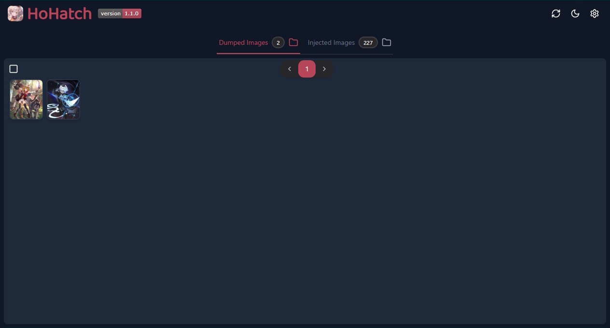

  

  

    
    
    
    
    
  

> [!TIP]
> **HoHatch** is a Windows-only desktop application that supports the management and conversion of image files (JPG/DDS) for [Shadowverse: Worlds Beyond](https://shadowverse-wb.com/). It provides functions to convert
> modded JPG files to DDS files, to convert DDS files dumped from the game to JPG files for mod creation.

  

## 📦 Installation

To use HoHatch, download the latest HoHatch application directly: [HoHatch-v1.2.2.zip](https://github.com/dracoboost/hohatch/releases/latest/download/HoHatch-v1.2.2.zip).
> [!NOTE]
> For older versions, go to the [Releases](https://github.com/dracoboost/hohatch/releases) page.

## 🔤 Logo Typeface

The HoHatch logo uses [Baloo Tamma 2](https://fonts.google.com/specimen/Baloo+Tamma+2?preview.text=HoHatch&query=Baloo+Tamma+2), a playful, rounded display sans-serif typeface from Google Fonts.

## 🤝 Contributing

Contributions are welcome!

### Documentation

- Features
  - HoHatch Application: ✨[`frontend/docs/FEATURES.md`](frontend/docs/FEATURES.md)
  - HoHatch Website: ✨[`website/docs/FEATURES.md`](website/docs/FEATURES.md)

- Development Guidelines and Testing Strategies
  - General: ✦[`GEMINI.md`](GEMINI.md)
  - HoHatch Application: ✦[`frontend/GEMINI.md`](frontend/GEMINI.md)
  - HoHatch Website: ✦[`website/GEMINI.md`](website/GEMINI.md)

- Changelogs
  - HoHatch Application: 📝[`frontend/CHANGELOG.md`](frontend/CHANGELOG.md)
  - HoHatch Website: 📝[`website/CHANGELOG.md`](website/CHANGELOG.md)

## 📜 License

MIT License ― free to use, modify, and share, but you must include copyright and license notice.
